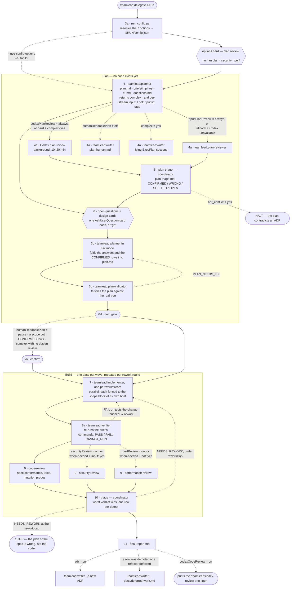
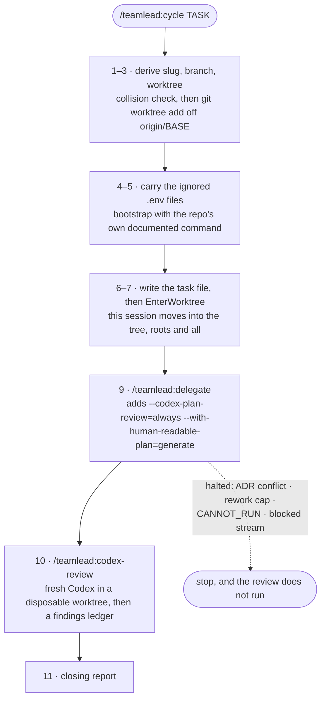

# teamlead

[](https://github.com/tp4k/claude-teamlead/actions/workflows/ci.yml)
[](LICENSE)

A [Claude Code](https://claude.com/claude-code) plugin for delegated work. One
command takes a task from a plan to reviewed commits: the coordinator decomposes
it, has the plan itself reviewed before a line is written, dispatches specialist
subagents in parallel, verifies what they produce, has the result reviewed on
three axes, and triages every finding — and never writes the code itself.

The separation is the point. A coordinator that starts editing files stops
tracking the other workstreams, and a reviewer that is also the author grades its
own homework. Each role here is a separate agent with its own context, its own
tools and its own report.

## Install

```
/plugin marketplace add tp4k/claude-teamlead
/plugin install teamlead@claude-teamlead
```

## Quick start

```
/teamlead:delegate Add rate limiting to the public API, 100 req/min per key
```

Answer the options card, answer the planner's questions (or type `go` to accept
every recommendation at once), and the run goes to reviewed commits on its own.
Nothing is merged or pushed.

Want the fresh worktree too?

```
/teamlead:cycle Add rate limiting to the public API, 100 req/min per key
```

## How a run works

Solid arrows always happen. **Dotted arrows are conditional** — the label is the
run option or the verdict that turns that step on. Step numbers match
`skills/delegate/SKILL.md`, so a diagram node and the instruction that produces
it carry the same name.



Three things the diagram is trying to make obvious:

- **The plan is graded before anything is built, and the validator goes last.** The
  design reviews run at 4a on the planner's draft; the Fix round at 6b folds every
  answer and every confirmed finding into `plan.md`; only then does the validator
  check the plan that will actually be built. Its review-axis upgrades are binding
  on the reviewers chosen at step 9, and there is no later moment that could apply
  them.
- **The verifier gate is cheap and sits before the expensive part.** Three reviewers
  are the most costly step of a round, so a small agent re-runs the tests first. A
  red suite then costs one sonnet agent instead of three opus ones, and the
  reviewers start from a known-green tree.
- **Both loops are bounded.** A verifier FAIL and a triage `NEEDS_REWORK` both
  return to step 7 with a fresh implementer, and `reworkCap` (default 3) is what
  stops that being infinite. Hitting the cap is a statement about the plan, not
  about the coder.

### `/teamlead:cycle` — the same run, plus the tree it runs in



The `EnterWorktree` call is not cosmetic. A path-scoped `CLAUDE.md` loads only for
files under one of the session's workspace roots — cwd alone does not do it — so a
coordinator still rooted in the primary checkout hands every subagent a workspace
the worktree is not inside.

## Where it stops for you

Four times in a full cycle, and you can see all four in the diagram above:

| # | Where | What you decide |
| --- | --- | --- |
| 1 | step 3a | The run options card. Current values are pre-marked — a chance to change your mind, not a form to fill in. |
| 2 | step 6 | The planner's open questions, plus a card for any design finding that is a real choice. `go` accepts every recommendation at once. |
| 3 | step 6d | The hold gate: the plan is final and something wants your eyes on it. This is where `$RUN/plan-human.md` is worth reading. |
| 4 | `codex-review` step 4 | Which triaged findings to act on. |

A fifth appears only on a worktree or branch collision. Nothing else is asked.

## Commands

| Command | What it does |
| --- | --- |
| `/teamlead:delegate <task>` | The full loop in the current tree: plan → review the plan → validate the plan → implement in parallel workstreams → verify → review (code, security, performance) → triage. Opens with a card for the run's options, stops for open questions and design findings before dispatch, and stops for good when the rework cap says the plan itself is wrong. |
| `/teamlead:cycle <task>` | `delegate` plus the tree it runs in: a fresh worktree off `origin/main`, bootstrapped with the repo's own setup command, the session moved into it and named after the work, then `delegate`, then `codex-review`. |
| `/teamlead:codex-review [target]` | An independent review by [Codex](https://github.com/openai/codex), given the run's task, plan and diff, with every finding triaged into a ledger where each row appears once with the evidence that settled it. |

Nothing in any of the three merges or pushes. There is no flag that makes them.

## Run options

Seven things about a run are yours to decide: whether the plan gets an outside
review, whether you get a version of it written for a human, and which of the
specialist reviews run at the end. You do not have to remember any of them.
`delegate` opens with a card for the ones worth deciding per run, and every
answer — typed, configured or clicked — is resolved by one script and written to
`$RUN/config.json`, so a resumed or compacted run can still say what it was
asked to do.

The **Turns on** column names the diagram node the option controls.

| Option | Flag | Values | Turns on | Effect |
| --- | --- | --- | --- | --- |
| `codexPlanReview` | `--codex-plan-review=<v>` | `off` · `hard` · `always` | 4a Codex plan review | An independent [Codex](https://github.com/openai/codex) review of the plan, before any code exists. `hard` runs it only when the planner called the task complex. |
| `opusPlanReview` | `--opus-plan-review=<v>` | `off` · `fallback` · `always` | 4a plan-reviewer | The same review by the in-session `teamlead:plan-reviewer`. `fallback` runs it only when Codex could not. |
| `humanReadablePlan` | `--with-human-readable-plan=<v>` | `off` · `generate` · `pause` | 4a writer, and the 6d gate | Writes `$RUN/plan-human.md` — the plan as prose, for reading rather than for dispatch. `pause` also holds the run until you have read it. |
| `securityReview` | `--security-review=<v>`, `--no-security-review` | `off` · `when-needed` · `on` | 9 security review | The security reviewer at the end. `when-needed` spawns it only for workstreams the planner tagged as attacker-reachable. |
| `perfReview` | `--perf-review=<v>`, `--no-perf-review` | `off` · `when-needed` · `on` | 9 performance review | The performance reviewer. `when-needed` spawns it only for workstreams the planner tagged as on a hot path. |
| `codexCodeReview` | `--codex-code-review` | `off` · `on` | 11 one-liner | Whether the closing report hands you the `/teamlead:codex-review` one-liner for the finished tree. |
| `adr` | `--adr` | `off` · `on` | 11 ADR writer | Whether the run records its decisions as an ADR. Reading ADRs is always on and needs no setting. |

`code-review` is never optional and has no setting — it is the one reviewer with
a solid arrow into it.

Two further flags decide how much the run asks you: `--use-config-options` skips
the options card and takes your config as the answer, and `--autopilot` skips the
card and every other stop that can be skipped. An explicit
`--with-human-readable-plan=pause` still stops, because a flag that names a stop
is a later and more specific instruction than one that waives stops in general.

Precedence, highest first: **card answer → flag → `<repo>/.teamlead.json` →
`$TEAMLEAD_HOME/config.json` → built-in default.** The card beats the flag
because you see the card after you typed the flag — it is your later word on the
same question.

A bad value is treated differently depending on where it came from. A typo in a
config file is skipped and the next tier answers; a typo in a flag stops the run
and names the valid values. The asymmetry is the point: a config is edited once
and read for months, so a stopping rule there breaks runs that have nothing to
do with the typo — while a flag was typed seconds ago by someone watching the
output, and quietly ignoring it would run the whole loop in a mode they did not
ask for.

`when-needed` depends on the planner's per-workstream tags, which the scope
fence is what makes meaningful. With `"scopeFence": false` both `when-needed`
settings are promoted to `on` rather than silently becoming a coin flip — an
unfenced run cannot tell you which files a workstream will touch.

## What gets installed

Six agents. Each pins its own model and tool set, so the coordinator passes none:

| Agent | Model | Writes |
| --- | --- | --- |
| `teamlead:planner` | opus | `plan.md`, the round-1 briefs, `questions.md` |
| `teamlead:plan-reviewer` | opus | `plan-design-review.md` |
| `teamlead:plan-validator` | opus | `plan-validation.md` |
| `teamlead:implementer` | sonnet | the code, its commits, its own report |
| `teamlead:verifier` | sonnet | `verifier-rN.md` |
| `teamlead:writer` | sonnet | `plan-human.md`, the living plan sections, an ADR, the deferred-work rows |

The reviewers at step 9 are harness agent types (`code-review`,
`performance-engineer`, `security-review`), chosen per run.

And four hooks the plugin carries itself, so that no one has to hand-edit
`~/.claude/settings.json`:

- **`PreToolUse` (allow)** pre-approves the report writes every teamlead agent
  makes inside its own state directory. It only ever grants: a write anywhere
  else gets no decision and follows the normal permission flow.
- **`PreToolUse` (deny)** refuses an implementer's write outside the fenced
  `scope` block of its own brief. It answers only for implementer subagents whose
  brief declares a fence, so every other write in the session — including yours —
  is untouched. Set `"scopeFence": false` to turn it off.
- **`PreToolUse` (step gate)** refuses a `teamlead:` planner, plan validator or
  implementer spawn while the run directory shows an earlier step still owed —
  no `config.json`, a promised plan review never started, no validation or relay
  before dispatch. It answers only for those roles on a real `$RUN`, so any other
  spawn is untouched. A Codex review that fails never blocks.
- **`UserPromptSubmit`** names the session after the run. It never overwrites a
  title you chose yourself.

Hooks are installed user-wide, so all four are written to stay silent outside a
teamlead run.

## Safety rails

- **Nothing merges or pushes**, in any command, under any flag.
- **The coordinator never edits the repo.** Its only writes are inside `$RUN`.
- **Implementers are fenced** to the scope block of their own brief, enforced by
  the deny hook at write time and again by the coordinator at triage.
- **Forbidden git operations** in every implementer brief: `reset --hard`,
  `rebase`, `commit --amend`, `push --force`, `stash drop`, `checkout -- <path>`,
  and deleting commits.
- **The author is never the witness.** A verifier that did not write the code
  re-runs the tests; reviewers spawn only on a verified PASS.
- **The plan never becomes a repo file.** A run leaves no untracked plan behind;
  the only repo files it may create are an ADR and `docs/deferred-work.md`.

## The run directory

Runs, worktree handover files and your config live under `$TEAMLEAD_HOME`,
default `~/.teamlead/` — deliberately outside the plugin, because
`claude plugin update` replaces the plugin's own directory. Set `TEAMLEAD_HOME`
to move all of it.

```
~/.teamlead/
├── config.json                     your settings
├── tasks/<slug>.md                 /teamlead:cycle handover file
└── runs/<worktree>/<ts>-<slug>/    one run — this is $RUN
    ├── task.md                     the task VERBATIM, flags stripped
    ├── config.json                 the 7 resolved options + which tier set each
    ├── plan.md                     the spec every later reader grades against
    ├── plan-human.md               the same plan in about a page   (humanReadablePlan)
    ├── questions.md                the planner's questions + your ## Answers
    ├── briefs/impl-wsN-rM.md       what each implementer is told to build
    ├── plan-review-package/        what Codex was given                (codexPlanReview)
    ├── plan-design-review.md       what it found
    ├── plan-triage.md              your verdict on each of its rows, with evidence
    ├── plan-validation.md          PLAN_VALID / PLAN_NEEDS_FIX
    ├── implementer-wsN-rM.md       each coder's own report
    ├── verifier-rM.md              the gate's exit codes and output tails
    ├── review-rM-{code,security,perf}.md
    ├── triage-rM.md                merged rows, one per defect
    └── final-report.md             what you get at the end
```

`plan-human.md` is the file to read if you want to know what the run is about to
do. `config.json` is the file to read if you want to know what it was asked to do.

## Requirements

- **Claude Code**, recent enough to support plugins.
- **git**. `/teamlead:cycle` also needs `git worktree`.
- **Python 3.9+** for the bundled scripts. Standard library only — nothing to
  install, no virtualenv.
- **[Codex CLI](https://github.com/openai/codex)** with a saved login
  (`codex login`), for `/teamlead:codex-review` and for the plan design review.
  Both are optional — `delegate` runs the whole loop without it, and a plan
  review that cannot start is reported, never fatal. Set `CODEX_BIN` if the
  binary is not on `PATH`.

## Configuration

Every setting is optional; no config file at all is a supported state. Copy
[`config.example.json`](config.example.json) to `~/.teamlead/config.json` and keep
the keys you want:

| Key | Default | Meaning |
| --- | --- | --- |
| `adrPath` | unset | Root of your ADR store. Unset, or set to a directory that does not exist, falls back to `<cwd>/docs/adr`, then skips ADRs entirely. |
| `adrSubdir` | `null` | Subdirectory within `adrPath`. |
| `reworkCap` | `3` | Rework rounds a workstream gets before triage must stop. |
| `maxAgeDays` | `30` | A run directory older than this is prunable. |
| `keepLastPerRepo` | `5` | ...unless it is among the newest N runs of its repo. |
| `scopeFence` | `true` | Whether the scope-fence hook refuses out-of-scope implementer writes. |
| `planValidatorPasses` | `1` | How many falsification passes the plan validator makes. `2` costs a second pass to catch what the first one's fixes broke. |
| `codexPlanReviewAxes` | all four | Which of `decomposition`, `task-fit`, `acceptance`, `design-fit` the plan design review covers. |
| the seven [run options](#run-options) | `off` | Same keys, same values as the flags — a config entry is how you stop typing one. |

A `<repo>/.teamlead.json` of the same shape overrides the global file for that
repo. A value of the wrong type is skipped rather than fatal: the next tier, then
the default, answers instead.

Every run option defaults to `off` **in code**, so a reader of `config.json`
never has to know which keys are secretly on. The security and performance
reviews are the exception in practice and not in the code: the first run seeds a
config containing `"securityReview": "on"` and `"perfReview": "on"`, which is
what keeps them running the way they did before options existed. It is an
ordinary config file with a note in it — edit or delete those two lines freely,
and nothing reseeds them.

## Troubleshooting

| Symptom | Cause and fix |
| --- | --- |
| `Agent type 'planner' not found` | The agent types are namespaced like the commands: `teamlead:planner`. The bare name is not registered. |
| The plan design review never appears | Codex has no saved login, or is not on `PATH`. The run reports it and continues by design — set `CODEX_BIN`, or run `codex login`. Set `opusPlanReview=fallback` so the review happens anyway. |
| A specialist review is missing from the report | `when-needed` with the planner's tag at `no` deletes that review rather than shrinking it. The final report names every specialist that did not run, and the tag that decided it. |
| Runs vanished from a path you had bookmarked | They live under `$TEAMLEAD_HOME`, and old ones are pruned at kickoff by `maxAgeDays` / `keepLastPerRepo`. |
| Kickoff says `REFUSED: another copy of this plugin` | A second directory under `~/.claude/skills/` (usually a worktree of this repo) registers as a plugin with the same name, and a session may load either copy's skills. Move it out (`git worktree move`), load test branches with `claude --plugin-dir <path>`, then start a new session. |
| No options card, no plan review, and old runs never had a `config.json` | The same shadowing, from before kickoff checked for it: the session ran an older copy's `delegate`. Fix as above. |
| A spawn is refused with `Not yet: this run is at step …` | The step gate found an earlier step still owed. Do the step it names; `run_state.py $RUN` shows where the run stands. |
| An implementer reports a file it was refused | That is the scope fence asking you to widen it. The next round's brief gets the whole new fence, or the request is declined along with the finding it came from. |

## Tests

No pytest, no dependencies — a suite that needs an install is a suite nobody
runs:

```sh
for suite in scripts/test_*.py; do python3 "$suite"; done
ruff check .
```

CI runs the same two things on Python 3.9 through 3.13.

## License

[MIT](LICENSE).
