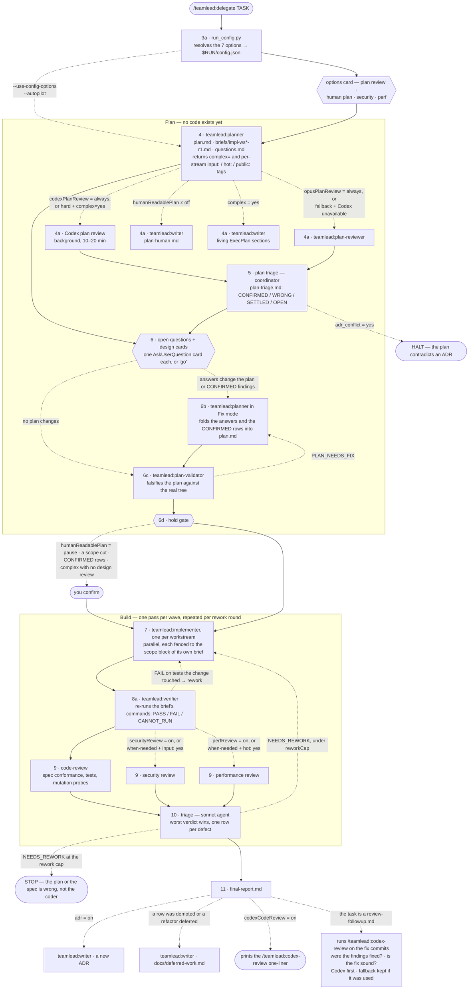
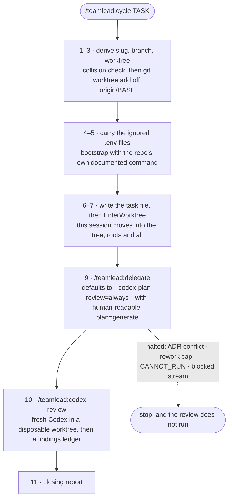

# teamlead

[](https://github.com/tp4k/claude-teamlead/actions/workflows/ci.yml)
[](LICENSE)

A [Claude Code](https://claude.com/claude-code) plugin for delegated work. One command plans a task, reviews the plan, dispatches specialist agents, verifies their changes, and triages code, security, and performance reviews. The coordinator manages the process without writing implementation code.

Each role has a separate context, tools, and report. This lets the coordinator track parallel work while independent agents check the implementation.

## Install

```
/plugin marketplace add tp4k/claude-teamlead
/plugin install teamlead@claude-teamlead
```

## Quick start

```
/teamlead:delegate Add rate limiting to the public API, 100 req/min per key
```

Answer the options card and any planner questions. Type `go` to accept all recommendations. The run then proceeds to reviewed commits, subject to its hold conditions. It does not merge or push.

Want the fresh worktree too?

```
/teamlead:cycle Add rate limiting to the public API, 100 req/min per key
```

## How a run works

The diagram shows routing paths and conditions for optional steps. Step numbers match `skills/delegate/SKILL.md`.


```mermaid
flowchart TD
    GO(["/teamlead:delegate TASK"])
    CFG["3a · run_config.py<br/>resolves the 7 options → $RUN/config.json"]
    CARD{{"options card — plan review ·<br/>human plan · security · perf"}}

    subgraph PLANPHASE["Plan — no code exists yet"]
      direction TB
      PLANNER["4 · teamlead:planner<br/>plan.md · briefs/impl-ws*-r1.md · questions.md<br/>returns complex= and per-stream input: / hot: / public: tags"]
      CODEXPR["4a · Codex plan review<br/>background, 10–20 min"]
      OPUSPR["4a · teamlead:plan-reviewer"]
      HUMAN["4a · teamlead:writer<br/>plan-human.md"]
      LIVING["4a · teamlead:writer<br/>living ExecPlan sections"]
      PTRIAGE["5 · plan triage — coordinator<br/>plan-triage.md: CONFIRMED / WRONG / SETTLED / OPEN"]
      ASK{{"6 · open questions + design cards<br/>one AskUserQuestion card each, or 'go'"}}
      FIX["6b · teamlead:planner in Fix mode<br/>folds the answers and the CONFIRMED rows into plan.md"]
      VALID["6c · teamlead:plan-validator<br/>falsifies the plan against the real tree"]
      HOLD{{"6d · hold gate"}}
    end

    subgraph BUILDPHASE["Build — one pass per wave, repeated per rework round"]
      direction TB
      IMPL["7 · teamlead:implementer, one per workstream<br/>parallel, each fenced to the scope block of its own brief"]
      VERIF["8a · teamlead:verifier<br/>re-runs the brief's commands: PASS / FAIL / CANNOT_RUN"]
      CODE["9 · code-review<br/>spec conformance, tests, mutation probes"]
      SEC["9 · security review"]
      PERF["9 · performance review"]
      TRIAGE["10 · triage — sonnet agent<br/>worst verdict wins, one row per defect"]
    end

    HALT(["HALT — the plan contradicts an ADR"])
    YOU(["you confirm"])
    STOP(["STOP — the plan or the spec is wrong, not the coder"])
    REPORT["11 · final-report.md"]
    ADRW["teamlead:writer · a new ADR"]
    LEDGER["teamlead:writer · docs/deferred-work.md"]
    CXR(["prints the /teamlead:codex-review one-liner"])
    RERUN["runs /teamlead:codex-review on the fix commits<br/>were the findings fixed? · is the fix sound?<br/>Codex first · fallback kept if it was used"]

    GO --> CFG
    CFG --> CARD
    CFG -.->|"--use-config-options<br/>--autopilot"| PLANNER
    CARD --> PLANNER

    PLANNER -.->|"codexPlanReview = always,<br/>or hard + complex=yes"| CODEXPR
    PLANNER -.->|"opusPlanReview = always, or<br/>fallback + Codex unavailable"| OPUSPR
    PLANNER -.->|"humanReadablePlan ≠ off"| HUMAN
    PLANNER -.->|"complex = yes"| LIVING
    PLANNER --> ASK
    CODEXPR --> PTRIAGE
    OPUSPR --> PTRIAGE
    PTRIAGE --> ASK
    PTRIAGE -.->|"adr_conflict = yes"| HALT
    ASK -.->|"answers change the plan or CONFIRMED findings"| FIX
    ASK -.->|"no plan changes"| VALID
    FIX --> VALID
    VALID -.->|"PLAN_NEEDS_FIX"| FIX
    VALID --> HOLD

    HOLD -.->|"humanReadablePlan = pause · a scope cut ·<br/>CONFIRMED rows · complex with no design review"| YOU
    YOU --> IMPL
    HOLD --> IMPL

    IMPL --> VERIF
    VERIF -.->|"FAIL on tests the change touched → rework"| IMPL
    VERIF --> CODE
    VERIF -.->|"securityReview = on, or<br/>when-needed + input: yes"| SEC
    VERIF -.->|"perfReview = on, or<br/>when-needed + hot: yes"| PERF
    CODE --> TRIAGE
    SEC --> TRIAGE
    PERF --> TRIAGE
    TRIAGE -.->|"NEEDS_REWORK, under reworkCap"| IMPL

    TRIAGE -.->|"NEEDS_REWORK at the rework cap"| STOP
    TRIAGE --> REPORT
    REPORT -.->|"adr = on"| ADRW
    REPORT -.->|"a row was demoted or a refactor deferred"| LEDGER
    REPORT -.->|"codexCodeReview = on"| CXR
    REPORT -.->|"the task is a review-followup.md"| RERUN
```

Three workflow rules explain the diagram:

- **Review before implementation.** Design reviews inspect the draft at step 4a. Step 6b incorporates answers and confirmed findings. Validation then checks the corrected plan at step 6c. Its review-tag upgrades govern step 9.
- **Verify before expensive reviews.** A sonnet agent reruns tests before full review. A failing suite therefore costs one small verification run instead of three opus reviews.
- **Bound rework.** Verifier failures and NEEDS_REWORK findings return to a fresh implementer. Both count toward `reworkCap`, default 3. Persistent failure at the cap requires examining the plan or spec.

### `/teamlead:cycle` — the same run, plus the tree it runs in


```mermaid
flowchart TD
    C(["/teamlead:cycle TASK"]) --> W["1–3 · derive slug, branch, worktree<br/>collision check, then git worktree add off origin/BASE"]
    W --> B["4–5 · carry the ignored .env files<br/>bootstrap with the repo's own documented command"]
    B --> M["6–7 · write the task file, then EnterWorktree<br/>this session moves into the tree, roots and all"]
    M --> D["9 · /teamlead:delegate<br/>defaults to --codex-plan-review=always --with-human-readable-plan=generate"]
    D --> R["10 · /teamlead:codex-review<br/>fresh Codex in a disposable worktree, then a findings ledger"]
    R --> F["11 · closing report"]
    D -.->|"halted: ADR conflict · rework cap ·<br/>CANNOT_RUN · blocked stream"| X(["stop, and the review does not run"])
```

`EnterWorktree` moves cwd and workspace roots together. Path-scoped CLAUDE.md loads only under those roots. Changing cwd alone can leave worktree subagents without its rules.

### How tests get written

One implementer writes tests and code. The test boundary preserves independent behavioral requirements:

1. **Plan behavior.** A `new:` line describes observable acceptance, such as the third request receiving 429. The implementer chooses assertions, fixtures, and mocks.
2. **Establish RED.** Each new test identifies a plausible wrong implementation and uses an input isolating its clause. It must fail behaviorally, not from broken imports or fixtures. Approximately 0–5 tests per stream is usual. Coverage percentage alone does not justify a test.
3. **Freeze.** Commit RED tests separately. Preserve every added line through implementation. `red_freeze.py` checks retained lines and reruns RED with `--run`. Later tests require a wrong implementation and an explanation of the coverage gap.
4. **Implement and probe.** After GREEN, temporarily break the specified behavior and confirm the test detects it. Add coverage for survivors without weakening frozen tests.
5. **Check independently.** The verifier reruns brief commands. Code review independently checks RED and probes significant criteria. Test-gap findings require a wrong implementation, a test it would pass, and the missing observable assertion.

The planner seeds a shared probe list from spec clauses. The implementer adds clauses introduced by its code. Review checks the list and reports surviving omissions as LIST_GAP.

For changes without reasonably testable behavior, report `tdd: NOT_APPLICABLE` with a precise reason. Examples include documentation, formatting, and pure renames.

## Where it stops for you

A cycle can present four routine decisions, subject to the selected settings:

| # | Where | What you decide |
| --- | --- | --- |
| 1 | step 3a | The run options card. Current values are pre-marked — a chance to change your mind, not a form to fill in. |
| 2 | step 6 | The planner's open questions, plus a card for any design finding that is a real choice. `go` accepts every recommendation at once. |
| 3 | step 6d | The hold gate: the plan is final and something wants your eyes on it. This is where `$RUN/plan-human.md` is worth reading. |
| 4 | `codex-review` step 4 | Which triaged findings to act on. |

Worktree collisions and ambiguous bootstrap setup can require additional decisions.

## Commands

In this workflow, planning defines the work. Design review assesses the approach. Validation checks plan facts against the repository. Verification executes commands and reports outcomes. Code and specialist reviews assess the implementation. Triage assigns findings their dispositions. User confirmation approves a plan or decision.

| Command | What it does |
| --- | --- |
| `/teamlead:delegate <task>` | Plans, reviews the plan, validates, implements, verifies, reviews code and selected specialist axes, then triages. Uses the current tree. Presents required decisions and stops if rework reaches its cap. |
| `/teamlead:cycle <task>` | Creates and bootstraps a worktree from origin/main by default. Moves the session, runs delegate, then runs codex-review. |
| `/teamlead:codex-review [target]` | Gives [Codex](https://github.com/openai/codex) the task, plan, and diff for independent review. Records every finding once with its triage verdict and evidence. |

Nothing in any of the three merges or pushes. There is no flag that makes them.

## Run options

Delegate resolves seven run options. They control design review, the human plan, specialist reviews, the closing review command, and ADR creation. The options card shows choices useful for the current run. `run_config.py` writes resolved values and their sources to `$RUN/config.json`. This record survives compaction and resume.

Codex-review separately resolves `opusCodeReview`, its fallback setting.

The **Turns on** column names the diagram node the option controls.

| Option | Flag | Values | Turns on | Effect |
| --- | --- | --- | --- | --- |
| `codexPlanReview` | `--codex-plan-review=<v>` | `off` · `hard` · `always` | 4a Codex plan review | An independent [Codex](https://github.com/openai/codex) review of the plan, before any code exists. `hard` runs it only when the planner called the task complex. |
| `opusPlanReview` | `--opus-plan-review=<v>` | `off` · `fallback` · `always` | 4a plan-reviewer | The same review by the in-session `teamlead:plan-reviewer`. `fallback` runs it only when Codex could not. |
| `humanReadablePlan` | `--with-human-readable-plan=<v>` | `off` · `generate` · `pause` | 4a writer, and the 6d gate | Writes `$RUN/plan-human.md` — the plan as prose, for reading rather than for dispatch. `pause` also holds the run until you read it and answer. |
| `securityReview` | `--security-review=<v>`, `--no-security-review` | `off` · `when-needed` · `on` | 9 security review | The security reviewer at the end. `when-needed` spawns it only for workstreams the planner tagged as attacker-reachable. |
| `perfReview` | `--perf-review=<v>`, `--no-perf-review` | `off` · `when-needed` · `on` | 9 performance review | The performance reviewer. `when-needed` spawns it only for workstreams the planner tagged as on a hot path. |
| `codexCodeReview` | `--codex-code-review` | `off` · `on` | 11 one-liner | Prints the codex-review command after completion. Review-followup tasks instead rerun review automatically, regardless of this setting. Codex runs first. Opus fallback remains available when it produced the earlier review. |
| `opusCodeReview` | `/teamlead:codex-review --opus-code-review=<v>` | `off` · `fallback` | codex-review 2b | When the Codex code review cannot run (no install, no login, a failure, a timeout), `teamlead:code-reviewer` reviews the same package instead. The ledger says which reviewer wrote it. |
| `adr` | `--adr` | `off` · `on` | 11 ADR writer | Whether the run records its decisions as an ADR. Reading ADRs is always on and needs no setting. |

Code review is mandatory and has no disabling setting.

`--use-config-options` skips the options card. `--autopilot` skips that card and other skippable stops. An explicit `--with-human-readable-plan=pause` still stops for the requested review.

Precedence is **card answer → flag → repository `.teamlead.json` → `$TEAMLEAD_HOME/config.json` → default**. The card is the user's latest answer and therefore overrides an earlier flag.

An invalid config value defers to the next tier. An invalid flag stops the run and lists valid values. This avoids breaking unrelated runs because of old config errors while preserving a newly entered command's intent.

`when-needed` uses each workstream's review tag. With `scopeFence: false`, both specialist settings become `on`. Unbounded file scope cannot reliably identify which stream needs a specialist.

## What gets installed

Eight agents. Each pins its own model and tool set, so the coordinator passes none:

| Agent | Model | Writes |
| --- | --- | --- |
| `teamlead:planner` | opus | `plan.md`, the round-1 briefs, `questions.md` |
| `teamlead:plan-reviewer` | opus | `plan-design-review.md` |
| `teamlead:plan-validator` | sonnet | `plan-validation.md` |
| `teamlead:implementer` | sonnet | the code, its commits, its own report |
| `teamlead:verifier` | sonnet | `verifier-rN.md` |
| `teamlead:triage` | sonnet | `triage-rN.md`, and the next rework brief on NEEDS_REWORK |
| `teamlead:writer` | sonnet | `plan-human.md`, the living plan sections, an ADR, the deferred-work rows |
| `teamlead:code-reviewer` | opus | `opus-review-rN.md` — only when `/teamlead:codex-review` falls back because Codex could not run |

The reviewers at step 9 are harness agent types (`code-review`,
`performance-engineer`, `security-review`), chosen per run.

The plugin installs five hooks without manual settings edits:

- **`PreToolUse` (allow)** pre-approves the report writes every teamlead agent
  makes inside its own state directory. It only ever grants: a write anywhere
  else gets no decision and follows the normal permission flow.
- **`PreToolUse` (deny)** refuses implementer edits outside the brief's active scope fence. It makes no decision for other writes. Set scopeFence to false to disable this check.
- **`PreToolUse` (step gate)** refuses planner, validator, or implementer dispatch when required earlier steps remain incomplete. Checks include config, promised review attempts, human plan, answers, Fix rounds, validation, and scope choices. Its step order matches run_state.py. It applies only to those roles in a real run. A failed Codex attempt does not block. Autopilot skips only configured skippable decisions.

- **`PreToolUse` (worktree)** pre-approves `/teamlead:cycle`'s one
  `EnterWorktree` switch, into the linked worktree its handover file in
  `$TEAMLEAD_HOME/tasks/` names, and only for the session that wrote it. Any
  other switch, or any other session, gets no decision.
- **`UserPromptSubmit`** names the session after the run. It never overwrites a
  title you chose yourself.

The plugin installs all five hooks user-wide. They make no decision outside teamlead runs.

## Safety rails

- **Nothing merges or pushes**, in any command, under any flag.
- **The coordinator never edits the repo.** Its only writes are inside `$RUN`.
- **Scope limits apply to implementers.** The hook refuses edits outside the brief. The coordinator checks scope again at triage.
- **The implementer role forbids these git operations:** `reset --hard`,
  `rebase`, `commit --amend`, `push --force`, `stash drop`, `checkout -- <path>`,
  and deleting commits.
- **The author is never the witness.** A verifier that did not write the code
  reruns the tests. Reviews follow PASS or the documented exception for untouched pre-existing failures.
- **RED tests stay fixed during implementation.** The reviewer checks the added lines with `scripts/red_freeze.py`. A findings row can explicitly authorize correction of an incorrect frozen test.
- **The plan never becomes a repo file.** A run leaves no untracked plan behind.
  the generated workflow records in the repo are ADRs and `docs/deferred-work.md`. Implementers create the files required by their tasks.

## The run directory

Run artifacts, worktree handover files, and config live under `$TEAMLEAD_HOME`, default `~/.teamlead/`. Plugin updates replace the plugin directory, so state lives separately. Set TEAMLEAD_HOME to move the state root.

```
~/.teamlead/
├── config.json                     your settings
├── tasks/<slug>.md                 /teamlead:cycle handover file
└── runs/<worktree>/<ts>-<slug>/    one run — this is $RUN
    ├── task.md                     the task VERBATIM, flags stripped
    ├── config.json                 the 7 resolved options + which tier set each
    ├── plan.md                     the spec every later reader grades against
    ├── plan-human.md               the same plan in about a page   (humanReadablePlan)
    ├── questions.md                the planner's questions + your ## Answers
    ├── briefs/impl-wsN-rM.md       what each implementer is told to build
    ├── briefs/review-rM-<axis>.md  each reviewer's brief, written by review_briefs.py
    ├── settled-rM.md               settled decisions copied into every reviewer brief
    ├── plan-review-package/        what Codex was given                (codexPlanReview)
    ├── plan-design-review.md       the in-session design review
    ├── plan-review-package/plan-review-r1.md   the Codex design review
    ├── plan-triage.md              your verdict on each of its rows, with evidence
    ├── plan-validation.md          PLAN_VALID / PLAN_NEEDS_FIX
    ├── implementer-wsN-rM.md       each coder's own report
    ├── verifier-rM.md              the gate's exit codes and output tails
    ├── review-rM-{code,security,perf}.md
    ├── triage-rM.md                merged rows, one per defect
    └── final-report.md             what you get at the end
```

Read plan-human.md for planned behavior. Read config.json for resolved run options.

## Requirements

- **Claude Code**, recent enough to support plugins.
- **git**. `/teamlead:cycle` also needs `git worktree`.
- **Python 3.9+** for the bundled scripts. Standard library only — nothing to
  install, no virtualenv.
- **[Codex CLI](https://github.com/openai/codex)** with a saved login
  (`codex login`), for `/teamlead:codex-review` and for the plan design review.
  Both are optional — `delegate` runs the whole loop without it, and the coordinator reports a plan
  review that cannot start and continues. Set `CODEX_BIN` if the
  binary is not on `PATH`.

## Configuration

Config files are optional. Copy [`config.example.json`](config.example.json) to `$TEAMLEAD_HOME/config.json` and retain the desired keys. The default path is `~/.teamlead/config.json`.

| Key | Default | Meaning |
| --- | --- | --- |
| `adrPath` | unset | ADR store root. Invalid or absent directories defer to the next config tier, then repository docs/adr. Skip ADR work if no store exists. |
| `adrSubdir` | `null` | Subdirectory within `adrPath`. |
| `reworkCap` | `3` | Rework rounds a workstream gets before triage must stop. |
| `maxAgeDays` | `30` | A run directory older than this is prunable. |
| `keepLastPerRepo` | `5` | ...unless it is among the newest N runs of its repo. |
| `scopeFence` | `true` | Whether the scope-fence hook refuses out-of-scope implementer writes. |
| `planValidatorPasses` | `1` | How many falsification passes the plan validator makes. `2` costs a second pass to catch what the first one's fixes broke. |
| `codexPlanReviewAxes` | all four | Which of `decomposition`, `task-fit`, `acceptance`, `design-fit` the plan design review covers. |
| the seven [run options](#run-options) | `off` | Same keys, same values as the flags — a config entry is how you stop typing one. |

Repository `.teamlead.json` overrides global config. Values of the wrong type defer to the next tier and then the default.

All run options default to `off` in code. The first run seeds user config with securityReview and perfReview set to on, preserving earlier behavior. These are ordinary editable settings. Removing them does not cause reseeding.

## Troubleshooting

| Symptom | Cause and fix |
| --- | --- |
| `Agent type 'planner' not found` | Use the namespaced agent type: `teamlead:planner`. The bare name is not registered. |
| The plan design review never appears | Codex has no saved login, or is not on `PATH`. The run reports it and continues by design — set `CODEX_BIN`, or run `codex login`. Set `opusPlanReview=fallback` so the review happens anyway. |
| `/teamlead:codex-review` stops with a Codex login or timeout error | Same cause, at the end of the cycle. Set `opusCodeReview=fallback` and an Opus review of the same package stands in. Its ledger identifies `reviewer: Opus fallback`. |
| A specialist review is missing from the report | `when-needed` with the planner's tag at `no` deletes that review rather than shrinking it. The final report names every specialist that did not run, and the tag that decided it. |
| Runs vanished from a bookmarked path | They live under `$TEAMLEAD_HOME`, and kickoff prunes old runs according to `maxAgeDays` / `keepLastPerRepo`. |
| Kickoff says `REFUSED: another copy of this plugin` | A second plugin copy under `~/.claude/skills/` can load the wrong skills. Move it out with `git worktree move`. Test branches with `claude --plugin-dir <path>` and start a new session. |
| No options card, no plan review, and old runs never had a `config.json` | The same shadowing, from before kickoff checked for it: the session ran an older copy's `delegate`. Fix as above. |
| The gate refuses a spawn with `Not yet: this run is at step …` | The step gate found an earlier step still owed. Complete the named step. `run_state.py $RUN` shows where the run stands. |
| The scope hook refuses a required file | That is the scope fence asking you to widen it. Expand the next brief with the full active fence, or explicitly decline the associated finding. |

## Tests

The test suites use Python's standard library and require no pytest installation:

```sh
for suite in scripts/test_*.py; do python3 "$suite"; done
ruff check .
```

CI runs the same two things on Python 3.9 through 3.13.

## License

[MIT](LICENSE).
